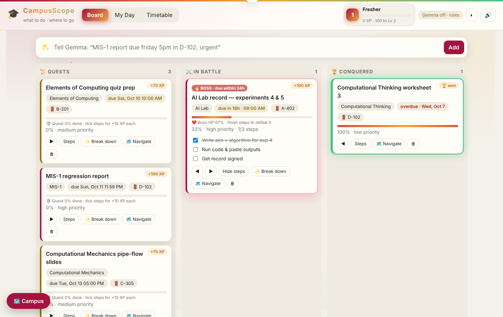
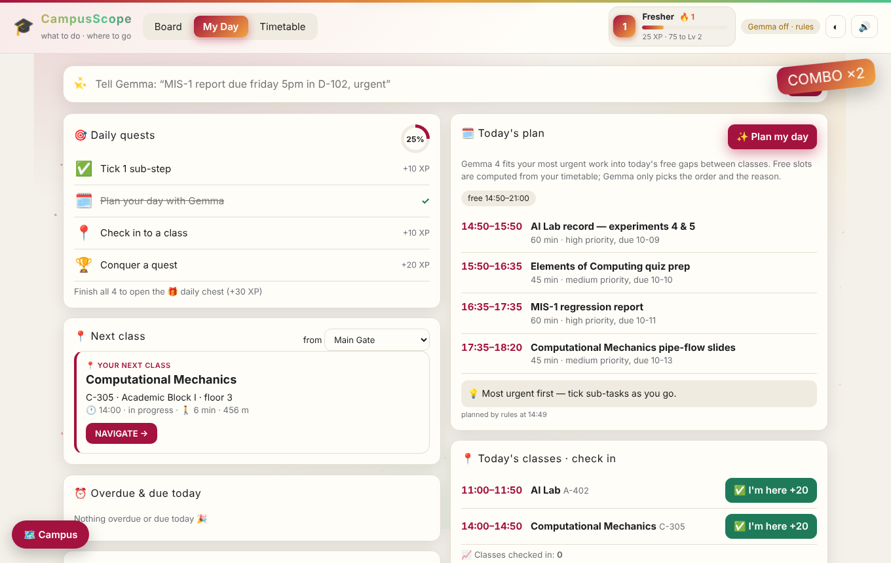

# 🎓 CampusScope

> **CampusScope tells you WHAT to do. Campus Navigator tells you WHERE to go and HOW to get there.**
> One student workspace for Amrita Vishwa Vidyapeetham, Coimbatore (Ettimadai): assignments, timetable and walking directions on campus, powered by **Gemma 4** running locally.

   

---

## The problem

A first-year student juggles lab records, reports, quizzes and slides across 5+ courses, and on a 400-acre campus still has to find **room A-402** five minutes before class. Today that means a notes app, a PDF timetable, WhatsApp groups and asking seniors for directions.

## What CampusScope does

| | Feature | Gemma 4's job |
|---|---|---|
| ✨ | **Quick add**: type *"MIS-1 report due friday 5pm in D-102, urgent"* and it becomes a structured assignment | Extracts title, course, due date, priority and room from one sentence |
| 🧩 | **Break down**: one click splits an assignment into 3–6 small steps with a progress bar | Writes the concrete sub-tasks and an effort estimate |
| 🗓️ | **Plan my day**: fits your most urgent work into the real free gaps between today's classes | Chooses the order and gives a reason; our code computes the free slots and validates every id |
| 🗺️ | **Campus Navigator**: *"take me from the library to CSE"*, *"nearest canteen that's open"*, *"where is A-402"* | Understands the request (intent + places) as JSON; Dijkstra computes the route |
| 📍 | **Next class card**: next class → room → building → walking time, with a *"leave now"* warning | (deterministic) |
| ♿ | Step-free routes, open-now status, 🚨 HELP button with verified contacts | Never used for emergencies; those replies are fixed text |

**Design rule: "Gemma understands, our code calculates, verified data answers."** Gemma never invents a place, a date, a room or a route. Everything it returns is validated against the campus database and the student's own data, and every feature has a rule-based fallback so the demo never breaks. See **[docs/GEMMA.md](docs/GEMMA.md)** for every prompt and why it exists.

| Board with Gemma quick-add + breakdown | My Day: next class + Gemma day plan |
|---|---|
|  |  |

---

## Architecture (2 frontends + 2 backends)

```
┌──────────────────────────────┐        ┌──────────────────────────────┐
│ frontend/workspace-ui  :5173 │        │ frontend/navigator-ui        │
│ Board · My Day · Timetable   │──embed─▶ Leaflet map · route cards    │
│ (vanilla JS, no build)       │ widget │ (served by navigator-api)    │
└──────────────┬───────────────┘        └──────────────┬───────────────┘
               │ REST/JSON                              │ REST/JSON
┌──────────────▼───────────────┐  next-class  ┌─────────▼────────────────────┐
│ backend/assignments-api :8766│─────────────▶│ backend/navigator-api  :8765 │
│ SQLite · quick-add · plan ·  │              │ campus graph · Dijkstra ·    │
│ breakdown · progress · myday │              │ NLU · rooms · hours · SOS    │
└──────────────┬───────────────┘              └─────────┬────────────────────┘
               └──────────────┬─────────────────────────┘
                     ┌────────▼─────────┐
                     │  Gemma 4 (E4B)   │  local via Ollama (default)
                     │  JSON in → JSON out │  or Google AI Studio
                     └──────────────────┘
```

Details: **[docs/ARCHITECTURE.md](docs/ARCHITECTURE.md)** · API reference: **[docs/API.md](docs/API.md)**

---

## Setup

### 1. Requirements

| Need | Version | Why |
|---|---|---|
| Python | 3.9 or newer | both backends + the UI server (standard library only, **no pip install**) |
| Ollama | latest | runs Gemma 4 locally, offline |
| Gemma 4 model | `gemma4:e4b` (16 GB RAM recommended) or `gemma4:e2b` on low-RAM laptops | the AI |
| A browser | Chrome / Edge / Firefox | the UI |

Full list with licences: **[docs/DEPENDENCIES.md](docs/DEPENDENCIES.md)**

### 2. Get Gemma 4

```bash
# install Ollama from https://ollama.com, then:
ollama pull gemma4:e4b
ollama run gemma4:e4b "say hi"      # quick check
```

No GPU / low RAM? Use `gemma4:e2b`, or Google AI Studio (see [Configuration](#configuration)).

### 3. Clone and run

```bash
git clone https://github.com/<your-org>/campusscope.git
cd campusscope
```

**Windows:** double-click `start-all.bat`
**Mac / Linux:** `./start-all.sh`

Or start each part in its own terminal:

```bash
cd backend/navigator-api   && python run.py    # http://localhost:8765  (API + map UI)
cd backend/assignments-api && python run.py    # http://localhost:8766  (API)
cd frontend/workspace-ui   && python serve.py  # http://localhost:5173  (open this)
```

Open **http://localhost:5173**. The chip in the top-right says `✨ Gemma 4 · gemma4:e4b` when the model is connected. If it says *rules fallback*, run `ollama serve` and `ollama pull gemma4:e4b`.

**Show it on a phone:** same Wi-Fi, open `http://<laptop-ip>:5173`.

### 4. Run the tests

```bash
python backend/navigator-api/tests/test_navigator.py
python backend/assignments-api/tests/test_assignments.py
```

---

## Usage

1. **Add work in plain English.** In the ✨ bar type `DSA lab record due tomorrow 9am in A-402, urgent` and press Add. The line below shows what was understood and by whom (`gemma (gemma4:e4b)` or `rules`).
2. **Break it down.** Click **✨ Break down** on a card. Gemma adds 3–6 steps; tick them and the progress bar and column update.
3. **Move cards** with ◀ ▶ or drag-and-drop between *To do / In progress / Done*.
4. **My Day tab.** Pick where you are → see your next class, the walking time and a *leave now* warning. Click **✨ Plan my day** for a time-boxed plan in today's free gaps.
5. **Navigate.** Any 🗺️ Navigate button (cards, timetable rows, next-class card) or the floating **🗺️ Campus** button opens the map. Ask things like:
   - `take me from the library to CSE`
   - `is there a canteen nearby that's open now`
   - `where is A-402` · `what's inside AB-II` · `my next class`
   - tick ♿ **Step-free** for routes without stairs; press 🚨 **HELP** in an emergency.
6. **Timetable tab.** Edit your classes (day, time, course, room) and Save. The next-class card and day plan use it.

### Configuration

All settings are environment variables (see `.env.example`):

| Variable | Default | Meaning |
|---|---|---|
| `GEMMA_PROVIDER` | `ollama` | `ollama`, `google` or `none` (rules only) |
| `GEMMA_MODEL` | `gemma4:e4b` | any Gemma 4 tag, e.g. `gemma4:e2b`; for Google e.g. `gemma-4-31b-it` |
| `OLLAMA_URL` | `http://localhost:11434` | point at a teammate's laptop to share one model |
| `GOOGLE_API_KEY` | — | only for `GEMMA_PROVIDER=google` |
| `GEMMA_EXPLAIN` | `0` | `1` lets Gemma re-word navigator answers (facts only) |
| `NAV_PORT` / `API_PORT` / `UI_PORT` | 8765 / 8766 / 5173 | ports |

Windows: `set GEMMA_MODEL=gemma4:e2b` · Mac/Linux: `export GEMMA_MODEL=gemma4:e2b`

UI pointing at another machine: `http://localhost:5173/?api=http://192.168.1.20:8766&nav=http://192.168.1.20:8765`

### Fixing the campus map (before the demo)

Coordinates in `backend/navigator-api/data/` started as approximations. Open http://localhost:8765, press **Alt+E**, drag the pins and junction dots onto the real spots, click **Save**. Room-code → building rules live in `data/rooms.json`; emergency numbers in `data/emergency.json` must come from official Amrita sources only. More: [docs/NAVIGATOR.md](docs/NAVIGATOR.md).

---

## Project structure

```
campusscope/
├── frontend/
│   ├── workspace-ui/        FE-1 · assignments board, My Day, timetable (HTML/CSS/JS modules)
│   └── navigator-ui/        FE-2 · Leaflet map UI, pin editor, widget.js drop-in
├── backend/
│   ├── navigator-api/       BE-1 · campus graph, Dijkstra, Gemma NLU, REST API
│   │   └── data/            campus database (locations, paths, rooms, emergency, timetable)
│   └── assignments-api/     BE-2 · SQLite store, Gemma quick-add / breakdown / plan, REST API
├── docs/                    architecture, Gemma usage, API, dependencies, demo script
├── start-all.sh / .bat      one-click start
├── .env.example             configuration template
└── LICENSE                  MIT
```

## Team

| Role | Folder | Member |
|---|---|---|
| FE-1 Workspace frontend | `frontend/workspace-ui` | _name_ |
| FE-2 Navigator frontend | `frontend/navigator-ui` | _name_ |
| BE-1 Navigator backend | `backend/navigator-api` | _name_ |
| BE-2 Assignments backend | `backend/assignments-api` | _name_ |

## Limitations & next steps

- Campus coordinates and room mapping must be verified on the ground (Pin Editor makes this a 10-minute job).
- Single-user local SQLite; next step is login + per-student data.
- Map tiles need internet; pins, paths and routes still draw offline.
- Planned: reminders/notifications, faculty-posted assignments, Malayalam/Tamil voice input via Gemma 4's multilingual support.

## License

[MIT](LICENSE) © 2026 CampusScope Team. Third-party: Leaflet (BSD-2-Clause, bundled in `frontend/navigator-ui/vendor/leaflet`), map data © OpenStreetMap contributors (ODbL), Gemma 4 model weights (Apache 2.0, downloaded separately, not in this repo).
